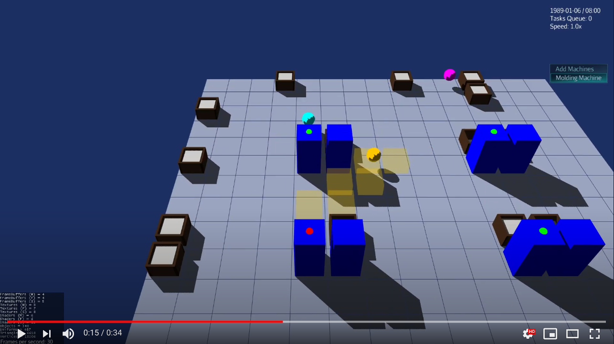

<a href="https://paypal.me/benckx/2">

</a>

# About

A basic camera system for a 3D management game for <a href="https://jmonkeyengine.org">jMonkeyEngine</a>
and <a href="https://www.lwjgl.org/">LWJGL</a>, that I developed while working on my
game *<a href="https://benckx.itch.io/elb">Everybody Loves Bricks</a>*

*Ouistiti* is French for marmoset.



* https://benckx.itch.io/elb
* https://www.youtube.com/watch?v=Tm6QexsctfQ
* https://www.youtube.com/watch?v=qzs6Z_jM6mE

# Features

Default key mappings can be overridden.

* Move camera by holding right click
* Zoom in and out with the mouse wheel
* Switch view with **V** (or use **T** for Top View, **I** for Isometric View)
* Rotate with **B** (counter-clockwise) and **N** (clockwise)
* Rotate on "world axis" (from player's perspective, the world rotates) by holding right click + keep left Control
  pressed
* Rotate on camera axis (from player's perspective, camera rotates like a security camera) by holding right click + keep
  left Shift pressed

It's assumed the floor is in the XY plane.

# Usage

## Import with Gradle

```groovy
repositories {
    maven { url "https://jitpack.io" }
}

dependencies {
    compile "com.github.benckx:ouistiti:1.2"
}
```

## Kotlin

```kotlin
import be.encelade.ouistiti.CameraManager
import com.jme3.app.SimpleApplication

//...

class DemoSimpleApp : SimpleApplication() {

    lateinit var cameraManager: CameraManager

    override fun simpleInitApp() {
        cameraManager = CameraManager(this)
        cameraManager.addDefaultKeyMappings()
    }

    override fun simpleUpdate(tpf: Float) {
        cameraManager.simpleUpdate(tpf)
    }

}
```

## Java

```Java
import be.encelade.ouistiti.CameraManager;
import com.jme3.app.SimpleApplication;

// ...

public static class DemoSimpleApp extends SimpleApplication {

    CameraManager cameraManager;

    @Override
    public void simpleInitApp() {
        cameraManager = new CameraManager(this);
        cameraManager.addDefaultKeyMappings();
    }

    @Override
    public void simpleUpdate(float tpf) {
        cameraManager.simpleUpdate(tpf);
    }

}
```

# Configuration

## Camera Speed

Implement the following interface and pass it as parameter of `CameraManager` to customize the movement speed.

```kotlin
interface CameraSpeedCalculator {

    fun cameraMovementSpeed(tpf: Float, cameraNode: CameraNode): Float

    fun cameraZoomSpeed(tpf: Float, value: Float, cameraNode: CameraNode): Float

}

```

# Examples

## In Kotlin

https://github.com/benckx/ouistiti/blob/master/src/test/kotlin/Demo.kt

## In Java

Sample project with Gradle configuration (Java 8):<br/>
https://github.com/benckx/ouistiti-java-sample

# Change log

## Version 2.0

* Rotation:
    * Either on "world axis" (the world rotates)
    * Either on the camera axis
    * Before these changes, only 90° fixed rotations were enabled, therefore `SIDE_VIEW` has been removed (since it's
      now a specific case of the `ISOMETRIC_VIEW`). The 2 modes remaining are `TOP_VIEW` and `ISOMETRIC_VIEW`.
* Move with WASD keys
* Upgrade Kotlin from 1.4.20 to 1.5.21
* Upgrade JME from 3.3.2-stable to 3.4.0-stable

## Version 1.2

* Use `chimp-utils` project
* Update Kotlin from 1.4.10 to 1.4.20
* Add more customizations settings (split `CameraSpeedCalculator`, split the different default key mappings, etc.)

# Related Project

Collection Kotlin of APIs and Helper:

* https://github.com/benckx/chimp-utils

If I manage to extract re-usable management game features from my game, I would move them to the ouistiti project, while
more generic / engine-related components would be added here in the chimp-utils project.
